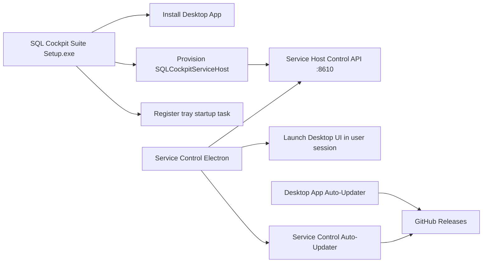

# Windows Service Control (Electron)

This app is a separate Windows desktop companion for controlling the SQL Cockpit SCM host.

It provides:

- tray icon access
- dedicated service-control UI
- in-app update checks and install prompts using `electron-updater`
- suite repair entrypoint (`Run Repair (UAC)`) for desktop/service/task reconciliation



## Capabilities

The Electron app supports:

- header environment badge (`Environment: Development Build` or `Environment: Production Build`)
- runtime profile suffix in the badge when available (for example `Runtime: prod`)
- Windows service status (`SQLCockpitServiceHost`)
- service start/stop actions
- component snapshot list (`id`, `display`, status, health, PID, restart count, last start, last error)
- per-component `Start`, `Restart`, `Stop`
- bulk `Start All`, `Restart All`, `Stop All`
- auto-refresh every 15 seconds
- quick action button to open Docs in the default browser (uses docs component URL from service settings, falls back to `http://127.0.0.1:8000/`)
- `Launch Desktop UI (User Session)` action that starts the `desktop-app` component command directly in the current logged-in user session
- automatic managed API bootstrap on app start:
  - reconciles `web-api` service settings contract (`--listenPrefix http://127.0.0.1:8000/`, `autoStart=true`, `workingDirectory={ApiRepoRoot}`)
  - ensures split-era repo root keys exist in settings (`desktopRepoRoot`, `apiRepoRoot`, `serviceRepoRoot`, `objectSearchRepoRoot`)
  - enforces `--serviceHostControlUrl` for `web-api` in prod mode so API startup contract is valid
  - attempts to start `SQLCockpitServiceHost` and `web-api` if they are not running
- in suite-managed prod mode, desktop launch is client-only (`-ExternalApiOnly true`) and connects to SCM-managed `web-api` on `http://127.0.0.1:8000/`
- desktop launch preflight that checks the configured desktop listen-prefix port before launch and shows an immediate warning if the port is already in use (warning-only; launch continues)
- `Run Repair (UAC)` action that re-runs suite provisioning with path migration and health validation
- update actions:
  - `Check For Updates`
  - `Install Downloaded Update`
- optional desktop app component (`desktop-app`) that should launch `Start-SqlCockpitDesktopPackaged.ps1` in client mode

## Files

- app directory: `service/windows/SqlCockpit.ServiceControl.Electron`
- launcher: `service/windows/Start-SqlCockpitServiceControlElectron.ps1`
- packager: `service/windows/Publish-SqlCockpitServiceControlElectron.ps1`
- logon startup installer (canonical): `service/windows/Install-SqlCockpitServiceTrayStartup.ps1`
- compatibility installer alias: `service/windows/Install-SqlCockpitServiceControlElectronStartup.ps1`

## Development run

```powershell
powershell -ExecutionPolicy Bypass -File ".\service\windows\Start-SqlCockpitServiceControlElectron.ps1"
```

With explicit settings path:

```powershell
powershell -ExecutionPolicy Bypass -File ".\service\windows\Start-SqlCockpitServiceControlElectron.ps1" `
  -SettingsPath "C:\ProgramData\SqlCockpit\sql-cockpit-service.settings.json"
```

Disable startup API auto-bootstrap for troubleshooting:

```powershell
powershell -ExecutionPolicy Bypass -File ".\service\windows\Start-SqlCockpitServiceControlElectron.ps1" `
  -AdditionalArgs "--autoStartApi=false"
```

Run launcher with elevation:

```powershell
powershell -ExecutionPolicy Bypass -File ".\service\windows\Start-SqlCockpitServiceControlElectron.ps1" `
  -SettingsPath "C:\ProgramData\SqlCockpit\sql-cockpit-service.settings.json" `
  -RunAsAdministrator
```

For clean installer retest cycles during development:

```powershell
powershell -ExecutionPolicy Bypass -File ".\service\windows\Reset-SqlCockpitServiceControlDevEnvironment.ps1"
```

## Build packages (Suite Installer)

Build NSIS installer + portable:

```powershell
powershell -ExecutionPolicy Bypass -File ".\service\windows\Publish-SqlCockpitServiceControlElectron.ps1"
```

Build portable only:

```powershell
powershell -ExecutionPolicy Bypass -File ".\service\windows\Publish-SqlCockpitServiceControlElectron.ps1" -PortableOnly
```

Output path:

- timestamped folder per build, for example `service/windows/publish/electron-control-20260414-203000/`

This avoids stale file-lock failures in `win-unpacked` when prior build artifacts are still in use.

Before building, the publisher now stages the desktop installer into `service/windows/DesktopBundle/SQL Cockpit setup.exe`.

If auto-discovery fails, pass an explicit desktop setup path:

```powershell
powershell -ExecutionPolicy Bypass -File ".\service\windows\Publish-SqlCockpitServiceControlElectron.ps1" `
  -DesktopSetupPath "C:\path\to\SQL Cockpit setup.exe"
```

## Installer provisioning behavior (Single Suite Flow)

The NSIS installer is now the canonical SQL Cockpit Suite installer and performs post-install provisioning automatically:

1. installs SQL Cockpit Desktop app from bundled setup payload
2. installs or updates `SQLCockpitServiceHost` (Windows SCM)
3. migrates settings so `desktop-app` uses packaged launcher + resolved desktop EXE path
4. starts service host and validates `http://127.0.0.1:8610/health`
5. registers/starts `SQLCockpitServiceTrayAtLogon`

Current implementation details:

- installer hook file: `service/windows/SqlCockpit.ServiceControl.Electron/build/installer.nsh`
- post-install script: `service/windows/SqlCockpit.ServiceControl.Electron/build/setup-scripts/post-install.ps1`
- post-uninstall script: `service/windows/SqlCockpit.ServiceControl.Electron/build/setup-scripts/post-uninstall.ps1`
- suite repair script: `service/windows/Repair-SqlCockpitSuite.ps1`
- suite install wrapper: `service/windows/Install-SqlCockpitSuite.ps1`

Prerequisites:

- run installer elevated (Administrator)
- `dotnet` SDK must be available on the machine, because suite provisioning runs `dotnet publish` from bundled service-host source

Uninstall policy:

- service host and tray task are removed by suite uninstall.
- desktop app is preserved by default and can be removed via its own uninstaller.

## In-app updates (GitHub releases)

The app uses `electron-updater` with GitHub provider configured in:

- `service/windows/SqlCockpit.ServiceControl.Electron/package.json`

Current publish target:

- owner: `jjmpsp`
- repo: `sql-cockpit-servicemanager`
- release type: `release`

### How updates work

1. publish a newer app version to GitHub releases
2. installed app checks for updates on startup (packaged mode)
3. app downloads update in background
4. UI enables `Install Downloaded Update`
5. app restarts and applies update

### Release checklist

1. increment app version in `service/windows/SqlCockpit.ServiceControl.Electron/package.json`
2. commit and push version change
3. create and push a semver tag (example: `v1.0.1`)
4. GitHub Actions workflow `service/.github/workflows/release-electron.yml` builds and publishes installer assets to GitHub Releases
5. verify client receives update prompt

Release runbook:

- [Windows Service Control Repo Release Runbook](windows-service-control-release.md)

## Auto-start at user logon

After building the app:

```powershell
powershell -ExecutionPolicy Bypass -File ".\service\windows\Install-SqlCockpitServiceTrayStartup.ps1" `
  -RunImmediately
```

Optional:

- `-TaskName "<custom-name>"`
- `-ExecutablePath "<full path to SQL Cockpit Service Control.exe>"`
- `-UseHighestPrivileges`

## Run as Administrator by default

Recommended approach:

- keep normal app startup, and let `Start Service`/`Stop Service` trigger UAC on demand (current behavior)
- this minimizes always-elevated app runtime while still allowing service control actions

Alternative approaches:

1. Start from a scheduled task with highest privileges:
- register task with `-UseHighestPrivileges`
- launch app via that task (or at logon)

2. Force app elevation at process startup (packaged build):
- set `build.win.requestedExecutionLevel` in `service/windows/SqlCockpit.ServiceControl.Electron/package.json` to `highestAvailable` or `requireAdministrator`
- caveat: app will request elevation every launch; this can increase friction and can complicate updater/install behavior in some environments

Operator instruction for manual elevated launch:

1. close the app
2. right-click `SQL Cockpit Service Control`
3. select `Run as administrator`

## Settings and API auth

The app reads `%ProgramData%\SqlCockpit\sql-cockpit-service.settings.json` by default.

Used fields:

- `serviceName`
- `listenPrefix`
- `apiKey`

If `apiKey` is present, requests include header:

- `X-SqlCockpit-Service-Key`

## Troubleshooting

| Symptom | Likely cause | Action |
| --- | --- | --- |
| UI cannot load runtime components | service host not running or bad control URL | validate `Get-Service SQLCockpitServiceHost` and `Invoke-WebRequest http://127.0.0.1:8610/health` |
| actions return `401` | API key mismatch | align `apiKey` between service settings and client |
| update checks fail in dev | app not packaged | expected; auto-updates are for packaged builds/releases |
| service start/stop fails | UAC was canceled or elevation failed | retry action and accept the UAC prompt; if it still fails, run the app elevated and verify local policy allows service control |
| start/stop shows `...canceled at UAC prompt` | user dismissed UAC prompt | click action again and approve UAC, or start/stop service from elevated PowerShell |
| desktop UI not visible when launched as service component | Session 0 / non-interactive service account | use `Launch Desktop UI (User Session)` from Service Control or run service under an interactive user account |
| desktop app launch shows no UI | settings still use legacy desktop launcher or a non-interactive launch path | use `Start-SqlCockpitDesktopPackaged.ps1` with `-ExternalApiOnly true`; Service Control auto-upgrades legacy launch paths when available |
| desktop UI opens but page shows `Not Found` or wrong app | desktop listen prefix port already in use (often stale docs/server process on `8000`) | clear the listener (`netstat -ano | findstr :8000`, then `Stop-Process -Id <pid> -Force`), then relaunch Desktop UI; packaged launcher now fails fast with a clear `Desktop API listen prefix ... is unavailable` error when the port is busy |
| suite install fails with missing desktop setup | desktop setup artifact was not bundled before build | run `Prepare-SqlCockpitSuiteDesktopBundle.ps1` (or pass `-DesktopSetupPath`) then rebuild suite installer |
| installer says app cannot be closed | tray/app process still running and locking install files | stop `SQL Cockpit Service Control`/`electron` processes, stop `SQLCockpitServiceTrayAtLogon` task, then click `Retry` |
| suite repair fails with `MSB3027/MSB3021` file lock on `SqlCockpit.ServiceHost.Windows.dll` | service host process still holds publish output | stop/kill `SQLCockpitServiceHost`, then rerun `Repair-SqlCockpitSuite.ps1` (optionally with `-SkipDesktopInstall` for faster retries) |

For dev cycles, use the wrapper script that pre-stops lock holders before launching installer:

```powershell
powershell -NoProfile -ExecutionPolicy Bypass -File ".\service\windows\Run-SqlCockpitSuiteInstaller.ps1"
```

UI diagnostics behavior (current implementation):

- `Version`, `Settings`, and `Control API` now render from metadata even when runtime status calls fail.
- if settings cannot be read, the status bar now includes a `settings:` warning with the exact error.
- if the control API is unreachable, the managed-components table now shows `No managed components available` with the runtime error text.
- if the Windows service query fails, the status bar now includes a `service:` warning while keeping the rest of the UI responsive.
