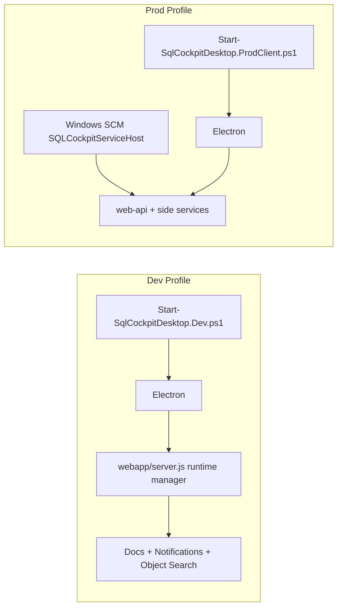
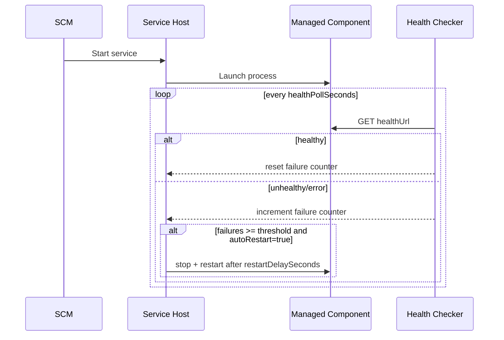

# Windows SCM Service Host

This guide is the primary training and operations manual for running SQL Cockpit services under Windows Service Control Manager (SCM).

## Purpose and audience

Use this document if you are:

- an operator who needs to start, stop, and validate SQL Cockpit runtime services
- a support engineer who handles incidents and restart loops
- a release engineer maintaining service upgrades and config changes

Primary goals:

1. keep API-side SQL Cockpit services healthy
2. make start/stop behavior predictable
3. provide a safe, repeatable maintenance procedure

Operator launch quickstart is documented in [Runtime Modes: Development vs Production](../user/runtime-modes.md).

## Scope

Windows SCM host files:

- project: `service/windows/SqlCockpit.ServiceHost.Windows`
- install script: `service/windows/Install-SqlCockpitWindowsService.ps1`
- uninstall script: `service/windows/Uninstall-SqlCockpitWindowsService.ps1`
- local test script: `service/windows/Test-SqlCockpitWindowsServiceHost.ps1`
- settings templates:
  - `service/windows/sql-cockpit-service.prod.settings.json`
  - `service/windows/sql-cockpit-service.dev.settings.json`
  - `service/windows/sql-cockpit-service.settings.json` (compatibility baseline)
- active deployed settings: `%ProgramData%\SqlCockpit\sql-cockpit-service.settings.json`

Related GUI bridge:

- service control page: `/service-manager`
- bridge path: Electron -> `webapp/server.js` -> Windows service control API
- standalone Electron control app: [Windows Service Control (Electron)](windows-service-control-electron.md)
  - startup script: `service/windows/Start-SqlCockpitServiceControlElectron.ps1`
  - package script: `service/windows/Publish-SqlCockpitServiceControlElectron.ps1`
  - tray-at-logon install script: `service/windows/Install-SqlCockpitServiceTrayStartup.ps1`
  - tray-at-logon uninstall script: `service/windows/Uninstall-SqlCockpitServiceTrayStartup.ps1`

## Design overview

The SCM service hosts a process supervisor. It starts and monitors child components, runs health checks, and optionally restarts unhealthy processes.

```mermaid
flowchart TD
    SCM[Windows SCM service: SQLCockpitServiceHost] --> Host[SqlCockpit.ServiceHost.Windows.exe]
    Host --> CtrlApi[Control API :8610]
    Host --> WebApi[web-api server.js :8000]
    Host --> Docs[Start-SqlTablesSyncDocsServer.ps1]
    Host --> Notify[Start-SqlTablesSyncNotificationsServer.ps1]
    Host --> Search[Start-SqlObjectSearchService.ps1]
    Desktop[Start-SqlCockpitDesktopPackaged.ps1] --> Electron[Desktop UI process]
    Electron --> WebApi
    ServiceManagerUI[/service-manager] --> CtrlApi
```

## Runtime ownership models

Use explicit profiles with strict ownership:

1. `dev` profile:
- launcher: `Start-SqlCockpitDesktop.Dev.ps1`
- desktop embedded manager owns side services
- no service host control URL

2. `prod` profile:
- SCM host owns `web-api`, `docs`, `notifications`, `object-search`
- desktop uses `Start-SqlCockpitDesktop.ProdClient.ps1`
- desktop controls via `ServiceHostControlUrl`

Do not mix ownership (for example, `ManageComponents=true` while `ServiceHostControlUrl` is also set).



## Startup and health lifecycle



## Control API contract

Base URL:

- from service settings `listenPrefix`
- default `http://127.0.0.1:8610/`

Endpoints:

- `GET /health`
- `GET /api/runtime/components`
- `POST /api/runtime/components/start-all`
- `POST /api/runtime/components/stop-all`
- `POST /api/runtime/components/restart-all`
- `POST /api/runtime/components/{id}/start`
- `POST /api/runtime/components/{id}/stop`
- `POST /api/runtime/components/{id}/restart`

Authentication behavior:

- if `requireLocalRequests=true`, only localhost callers are accepted
- if `apiKey` is set, callers must send header `X-SqlCockpit-Service-Key`

## Service settings reference

Settings file:

- `%ProgramData%\SqlCockpit\sql-cockpit-service.settings.json`

| Setting | Storage location | Valid values | Default | Code paths affected | Operational risk | Safe change procedure |
| --- | --- | --- | --- | --- | --- | --- |
| `serviceName` | JSON root | Service-safe name | `SQLCockpitServiceHost` | installer, SCM registration, host metadata | Name mismatch causes operator confusion and broken automation scripts. | Keep aligned with installer `-ServiceName`. |
| `repoRoot` | JSON root | Absolute path | inferred when omitted | path expansion, working directory resolution | Bad root breaks script/project resolution for all components. | Verify `repoRoot` contains `webapp`, scripts, and `object-search` before restart. |
| `desktopRepoRoot` | JSON root | Absolute path | `{repoRoot}\webapp` when omitted | `{DesktopRepoRoot}` token expansion for component command/args/working directory | Wrong path breaks desktop launcher and packaged artifact discovery. | Set to desktop repo containing `package.json` and `electron/`, then validate Desktop UI launch. |
| `apiRepoRoot` | JSON root | Absolute path | `{repoRoot}\sql-cockpit-api` when omitted | `{ApiRepoRoot}` token expansion for component command/args/working directory | Wrong path breaks `web-api` startup when API is split to a separate repository. | Set to the directory containing `server.js`, then verify component `web-api` starts and `/health` returns `200`. |
| `serviceRepoRoot` | JSON root | Absolute path | `{repoRoot}\service` when omitted | `{ServiceRepoRoot}` token expansion and service-host log path root (`Logs\ServiceHost`) | Wrong path causes launcher and maintenance scripts to fail or write logs to unexpected locations. | Set to service-control repo root containing `windows\` scripts, then restart host and verify logs are created under that repo. |
| `objectSearchRepoRoot` | JSON root | Absolute path | `{repoRoot}\object-search` when omitted | `{ObjectSearchRepoRoot}` token expansion for object-search command/args/working directory | Wrong path prevents object-search service from starting and breaks search features. | Set to object-search repo root containing `SqlObjectSearch.Service\`, then validate `http://127.0.0.1:8094/health`. |
| `listenPrefix` | JSON root | `http://127.0.0.1:<port>/` | `http://127.0.0.1:8610/` | host control API listener | Port conflict or invalid URL blocks all remote management. | Pick unused localhost port, restart service, then test `/health`. |
| `requireLocalRequests` | JSON root | `true`/`false` | `true` | host request authorization | `false` broadens attack surface if host is reachable beyond localhost. | Keep `true` unless explicitly placing behind secured internal gateway. |
| `apiKey` | JSON root | String | empty | host auth and desktop bridge auth | Key mismatch returns `401`; empty key lowers protection. | Rotate key during maintenance, update desktop launch parameters at same time. |
| `autoStart` | JSON root | `true`/`false` | `true` | host startup behavior | `false` can leave components unexpectedly offline after service start. | Use `false` only for controlled maintenance/testing windows. |
| `autoRestart` | JSON root | `true`/`false` | `true` | restart policy | `false` can extend outages after crashes. | Keep `true` for operations; disable temporarily only for crash forensics. |
| `healthPollSeconds` | JSON root | Integer >= 1 | `5` | health scheduler cadence | Too low increases local resource usage; too high delays detection. | Tune in small increments, monitor host logs after each change. |
| `healthFailureThreshold` | JSON root | Integer >= 1 | `3` | unhealthy restart threshold | Too low can cause restart flapping on transient failures. | Start with `3`, lower only if endpoint stability is proven. |
| `restartDelaySeconds` | JSON root | Integer >= 1 | `3` | restart backoff | Too low can create tight restart loops. | Keep >= 3 seconds unless coordinated stress test says otherwise. |
| `components[]` | JSON root array | component objects | template set | process launch + per-component health checks | Invalid command/args/health URL breaks one component or whole runbook. | Modify one component at a time, then validate via control API snapshot. |
| `components[].autoRestart` | JSON component object | `true`/`false` | `true` | per-component crash/health restart policy | `true` for GUI apps can create rapid restart loops and noisy logs. | Set `false` for interactive UI components (for example `desktop-app`), keep `true` for headless services. |

### Component object reference

Each `components[]` item supports:

- `id` (unique key, used in API routes)
- `displayName` (operator-facing label)
- `disabled` (`true`/`false`)
- `autoStart` (`true`/`false`)
- `autoRestart` (`true`/`false`, defaults to `true`)
- `command`
- `args` (array)
- `workingDirectory`
- `healthUrl` (optional but strongly recommended)

Token expansion supported in `command`, `args`, and `workingDirectory`:

- `{RepoRoot}`
- `{DesktopRepoRoot}`
- `{ApiRepoRoot}`
- `{ServiceRepoRoot}`
- `{ObjectSearchRepoRoot}`
- `{SettingsDirectory}`

Recommended port split for service-hosted desktop launch:

- `web-api` managed component (`--listenPrefix`): `http://127.0.0.1:8000/`
- `docs` component listen prefix: `http://127.0.0.1:8001/`
- `desktop-app` client target (`-ListenPrefix`): `http://127.0.0.1:8000/` with `-ExternalApiOnly true`

## Installation procedure (first install)

Run in elevated PowerShell:

```powershell
cd "C:\Scripts\SQL Tables Sync"
powershell -ExecutionPolicy Bypass -File ".\service\windows\Install-SqlCockpitWindowsService.ps1" -SettingsProfile prod -StartAfterInstall
```

Optional dev template install:

```powershell
powershell -ExecutionPolicy Bypass -File ".\service\windows\Install-SqlCockpitWindowsService.ps1" -SettingsProfile dev -StartAfterInstall
```

Validate:

```powershell
Get-Service SQLCockpitServiceHost
Invoke-WebRequest -UseBasicParsing http://127.0.0.1:8610/health
Invoke-WebRequest -UseBasicParsing http://127.0.0.1:8610/api/runtime/components
```

## Upgrade and rollback

### Upgrade

1. backup `%ProgramData%\SqlCockpit\sql-cockpit-service.settings.json`
2. run installer again (publishes latest host and updates SCM binary path)
3. run validation checks above
4. open `/service-manager` and confirm components report expected state

### Rollback

1. stop service: `Stop-Service SQLCockpitServiceHost`
2. restore prior host publish output and settings backup
3. rerun installer to point service to restored binary path
4. start and revalidate

## Desktop GUI integration

To control SCM-managed components from SQL Cockpit GUI:

```powershell
powershell -ExecutionPolicy Bypass -File ".\Start-SqlCockpitDesktop.ProdClient.ps1" `
  -ConfigServer "<server>" `
  -ConfigDatabase "<db>" `
  -ConfigSchema "Sync" `
  -ConfigIntegratedSecurity `
  -ServiceHostControlUrl "http://127.0.0.1:8610"
```

If `apiKey` is set in service settings, also provide:

```powershell
-ServiceHostApiKey "<same-key>"
```

## Day-2 operations checklist

### Daily

1. `Get-Service SQLCockpitServiceHost`
2. `GET /health`
3. `GET /api/runtime/components`
4. review any component with `health.status != healthy`

### Development startup

```powershell
powershell -ExecutionPolicy Bypass -File ".\Start-SqlCockpitDesktop.Dev.ps1" `
  -ConfigServer "<server>" `
  -ConfigDatabase "<db>" `
  -ConfigSchema "Sync" `
  -ConfigIntegratedSecurity
```

Expected dev behavior:

- docs run in MkDocs live-reload mode
- notifications run with Node watch mode
- object search runs with `dotnet watch run`
- desktop embedded runtime owns service lifecycle

### Before business hours cutover

1. verify all configured component `healthUrl` values manually
2. confirm no port collisions (`netstat -ano`)
3. restart service and re-check component snapshot

### After maintenance

1. confirm restart counts are stable
2. confirm no repeated unhealthy transitions
3. verify `/service-manager` reflects service host status

## Logging and diagnostics

Expected locations:

- service host output and component process logs under repository `Logs/ServiceHost/<component-id>/`
- component-native logs where each component already writes

Useful commands:

```powershell
Get-Service SQLCockpitServiceHost
sc.exe query SQLCockpitServiceHost
sc.exe qc SQLCockpitServiceHost
Invoke-WebRequest -UseBasicParsing http://127.0.0.1:8610/api/runtime/components
```

## Troubleshooting matrix

| Symptom | Likely cause | Immediate action |
| --- | --- | --- |
| Service is installed but not running | config error or startup failure | `Start-Service`, then inspect logs and component command paths. |
| `401 Unauthorized` from control API | missing/wrong API key | align `apiKey` and desktop `-ServiceHostApiKey`. |
| GUI Service Manager shows stale/unreachable state | bad `ServiceHostControlUrl` or host offline | test host `/health` directly; fix desktop launch args. |
| Component restart loop | bad command/args or failing health endpoint | disable `autoRestart` temporarily, fix component config, then re-enable. |
| Port already in use | component conflicts with existing process | change port in settings and dependent launch args, restart service. |
| desktop-app fails to launch | desktop EXE path not found on host | use `Start-SqlCockpitDesktopPackaged.ps1` with `-DesktopExecutablePath` set to installed `SQL Cockpit.exe`; if explicit path is stale, launcher now logs a warning and falls back to discovery (`Program Files`, `Program Files (x86)`, `%LOCALAPPDATA%\Programs\SQL Cockpit`, and latest `desktop-*` portable build folders under `webapp\publish`/`desktop-publish`). |
| desktop-app points to old script/invalid path after upgrade | legacy split-installer settings remained | run `Repair-SqlCockpitSuite.ps1` as Administrator to reapply suite-managed desktop component args and executable path |
| `Start-SqlCockpitDesktop*.ps1` throws `The variable '$LASTEXITCODE' cannot be retrieved because it has not been set` | PowerShell strict-mode edge case when launching GUI process that does not populate `LASTEXITCODE` | update to latest launcher scripts; both launchers now handle missing `LASTEXITCODE` safely and default to exit code `0` when unset |
| packaged desktop stays on `Starting SQL Cockpit desktop app...` then times out on `/health` | packaged API resolved repo root to a non-writable install path (for example under `Program Files\...\resources`) | update to launcher + desktop build that passes `SQL_COCKPIT_REPO_ROOT`; the embedded API now uses this explicit repo root for local data/log paths |

## Security and governance guidance

1. keep `listenPrefix` on localhost unless formally reviewed
2. use `apiKey` in shared environments
3. restrict who can edit `%ProgramData%\SqlCockpit\sql-cockpit-service.settings.json`
4. review service account rights if moving away from defaults

## Training plan for new operators

### Session 1: Concept and architecture (30 min)

1. identify each managed component and its health endpoint
2. explain service host vs desktop runtime ownership
3. walkthrough of `GET /api/runtime/components`

### Session 2: Hands-on operations (45 min)

1. restart one component via API
2. restart all components via `/service-manager`
3. verify restart counts and health status transitions

### Session 3: Incident drills (45 min)

1. simulate bad health URL
2. detect unhealthy state
3. execute safe rollback to known-good settings

## Known limitations

- Windows services run in Session 0.
- Uncertain conclusion (requires environment-specific validation): interactive Electron windows launched directly by SCM may not appear for logged-in users without additional session-bridge design.
