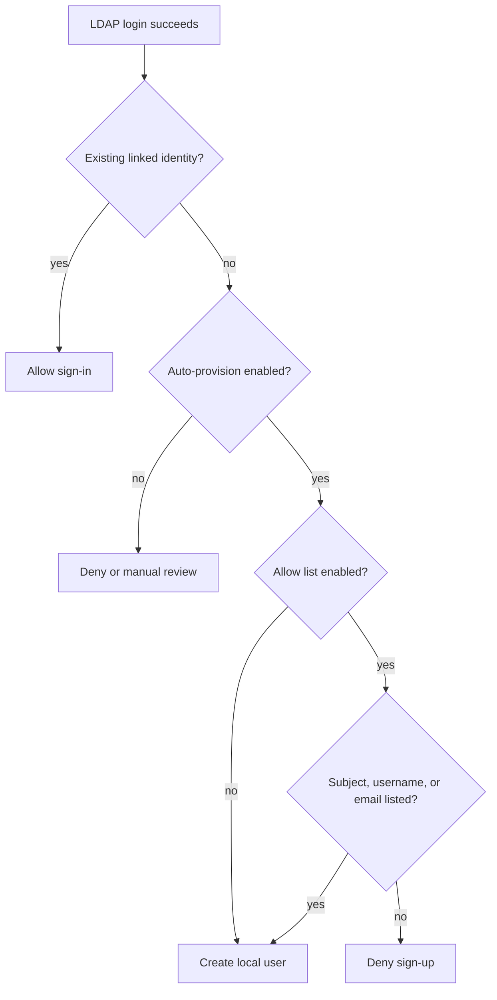

# Auth Provider Settings

Admins use `/admin/auth-providers` to enable local, LDAP, and Azure AD login providers. The **Sign-up Allow List** child page at `/admin/signup-allow-list` controls which external users may create a new local SQL Cockpit account and, separately, whether external login itself is restricted to the same saved list.

Default behavior is open sign-up and open external login: `externalSignupAllowListEnabled=false`, `externalLoginAllowListEnabled=false`, and `externalSignupAllowList=[]`. When sign-up restriction is enabled, only listed external subjects, usernames, or emails can be auto-provisioned. Existing linked identities are not blocked unless login restriction is also enabled.

## Safe workflow

1. Keep local login enabled as a break-glass path.
2. Confirm the prefilled LDAP connection values match the running environment.
3. Search LDAP from `/admin/signup-allow-list` using anonymous search, configured service bind, or BIND credentials. Leave the search text blank to load the matching directory set; the UI paginates locally at 100 users per page and supports sorting plus filters for text, account status, department, and allow-list state. Enter a name, UPN, username, or email to narrow the LDAP request itself. `SQL_COCKPIT_LDAP_BIND_USERNAME` pre-fills the username and selects bind mode when configured; the password is not stored.
4. Add the intended users, enable sign-up restriction or login restriction as needed, and save. Add/remove actions for allowed users are saved to the database immediately.
5. Test one listed LDAP user and one unlisted LDAP user.

## API and settings

| Item | Details |
| --- | --- |
| `GET /api/admin/settings/auth-providers` | Requires `admin.settings.edit`; returns provider and allow-list settings. |
| `PUT /api/admin/settings/auth-providers` | Requires `admin.settings.edit`; updates provider and allow-list settings. |
| `POST /api/admin/settings/auth-providers/ldap/search` | Requires `admin.settings.edit`; body contains optional `query`, `useBindCredentials`, optional `bindUsername`, optional `bindPassword`, and optional `limit`; a blank query lists all matching users by walking LDAP paged-results internally; the admin UI paginates the returned set at 100 users per page; credentials are required only when `useBindCredentials=true`; returns LDAP users suitable for the allow list plus directory-manager fields and diagnostics such as bind mode, base DN, page size, returned count, and whether the max-row cap truncated results. |
| `auth.provider.config.externalSignupAllowListEnabled` | SQLite `settings.value_json`; boolean; default `false`; high risk because it changes who can create accounts. |
| `auth.provider.config.externalLoginAllowListEnabled` | SQLite `settings.value_json`; boolean; default `false`; very high risk because it changes who can sign in through external providers, including existing linked identities. |
| `auth.provider.config.externalSignupAllowList` | SQLite `settings.value_json`; array of LDAP/OIDC match objects; default `[]`; high risk if identifiers are wrong. |
| LDAP connection prefill | Process environment: `SQL_COCKPIT_LDAP_URL`, `SQL_COCKPIT_LDAP_BIND_USER`, `SQL_COCKPIT_LDAP_BIND_PASSWORD`, and `SQL_COCKPIT_LDAP_SEARCH_BASE` are the normal setup keys. `SQL_COCKPIT_LDAP_DOMAIN`, `SQL_COCKPIT_LDAP_USER_PRINCIPAL_SUFFIX`, `SQL_COCKPIT_LDAP_BIND_USERNAME`, `SQL_COCKPIT_LDAP_SEARCH_FILTER`, and `SQL_COCKPIT_LDAP_SKIP_CERT_VALIDATION` are optional. Leave `SQL_COCKPIT_LDAP_SEARCH_FILTER` blank unless a directory needs a custom exact-user filter; SQL Cockpit automatically matches UPN, `sAMAccountName`, and email. Non-secret values are shown in admin diagnostics. Prefer the exact service-account bind DN if AD rejects the UPN form. Legacy aliases `LDAP_BIND_USER`, `LDAP_BIND_PASS`, `LDAP_SEARCH_BASE`, and `LDAP_SEARCH_FILTER` are accepted by the Node API when present in the process environment. |

Safe change procedure: update in non-production first, keep a local admin active, verify whether anonymous LDAP search is permitted, list LDAP users with a low limit or narrow query, add one known LDAP test user, enable the flag, save, and test both allowed and denied sign-up paths.

If anonymous listing returns zero users, check the diagnostics base DN and retry with **Use bind username and password for search**. Some directories allow anonymous bind/rootDSE discovery but deny anonymous subtree user listing.

If service bind succeeds but search fails with a message like "successful bind must be completed", AD referral chasing may be continuing a root-domain subtree search on an unbound connection. SQL Cockpit disables referral chasing for LDAP searches; verify standalone tooling uses the same behavior or narrows the search base to the intended OU/domain.

If credentialed search can bind but cannot read directory attributes, SQL Cockpit may return a verified bound-user entry for the exact bound account. That entry is safe for the allow list because it matches the LDAP principal proven by bind, but it will not include directory-only fields such as DN or object GUID. Use a dedicated directory read/search bind account when admins need to list or search other users.

When a user enters valid LDAP credentials but is not on the saved allow list, the login page says an administrator needs to add them to the allowed LDAP users list. This means authentication succeeded but local account creation or external login was blocked by the active admin policy.
