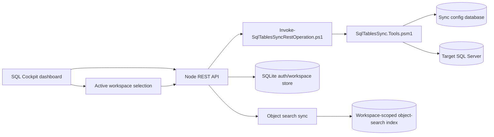
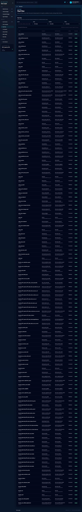
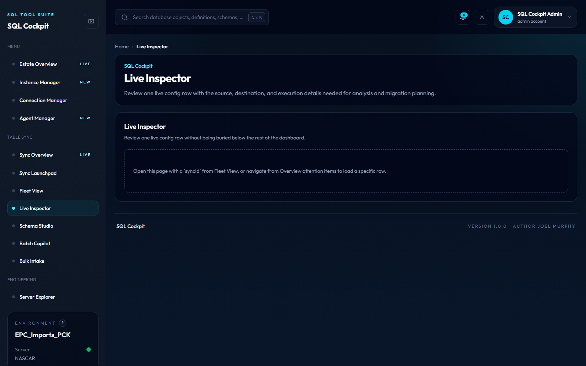
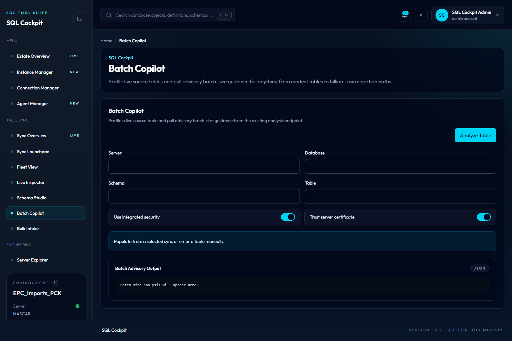

# Dashboard Guide

SQL Cockpit is a browser workspace for local SQL Server operations. The dashboard calls the local Node REST host, which calls PowerShell, which reads SQL Server metadata or SQL Cockpit config tables.

You can also run the same dashboard as a standalone desktop window through Electron using `Start-SqlCockpitDesktop.ps1`.

## Page Map

The left navigation groups pages as follows:

| Heading | Pages |
| --- | --- |
| Overview | Estate Overview, Instance Manager, Connection Manager |
| Operations & Monitoring | Agent Manager, Runtime Analysis, Job Run History, Agent Runtime Comparison |
| Data Synchronisation | Sync Overview, Sync Launchpad, Fleet View, Live Inspector, Schema Studio, Largest Tables, Index Inspector, Batch Copilot, Bulk Intake |
| Development & Engineering | Server Explorer, Visual Server Explorer, View Mapper, Procedure Repointer, Stored Procedure Mapper, SQL Editor, Task Manager |
| Access & Administration | Users, RBAC, Workspaces (directory, create team, invites), Roles, Auth Providers, Active Sessions, Audit Logs |
| System Configuration | SMTP Settings, Cache, Service Manager |

Administration and system-configuration entries are still permission-filtered. `Workspaces` expands to `/admin/workspaces`, `/admin/workspaces/create`, and `/admin/workspaces/invites`; legacy `/admin/teams*` routes redirect to the matching workspace route. Signed-in users also have `/workspaces`, which lists their personal and team workspaces; legacy `/teams` redirects there. The create page requires `teams.create`, while invite creation/revocation requires `teams.assign_members`. `Service Manager` appears in System Configuration only for users with `service.status`; `Task Manager` appears in Development & Engineering for standard signed-in users because the built-in `standard_user` role includes `tasks.view`.

Submenus in the left navigation are collapsed by default to reduce scrolling through the menu. Use the small expand control on a parent item to show its action pages. When a child action page is active, its parent group opens automatically. Manager-style pages also render a compact inline page menu above the content so action pages remain visible in focus mode.

Every left-navigation dashboard page renders the shared intro card above the page body. The card shows the SQL Cockpit eyebrow, page title, page description, and a docs action that points to the matching MkDocs page path. The docs link is shown even when that documentation page is planned but not yet built.

Dashboard tables use a shared row hover state so operators can track the active row while scanning dense sync, estate, Agent, admin, and SQL Editor grids.

The Welcome Page keeps the greeting and workflow search above the workspace controls. On large dashboard viewports, **Active workspace** and **Good starting points** share a two-column row; on narrower screens they stack vertically. The workspace switcher and quick-start buttons include icons so their intent remains scannable in the compact dashboard layout.

Instance Manager SQL Server discovery results render as a table with instance, server, version, cluster state, and a direct **Use Server** action.

| Page | Use it for | Data touched |
| --- | --- | --- |
| Estate Overview | Health, capacity, database state, and SQL Agent summary across saved instances. | Live SQL Server metadata only. |
| Launchpad | Quick navigation into common SQL Cockpit workflows. | Browser state only. |
| Instance Manager | Server-level profiles for Server Explorer, SQL Agent Manager, Estate Overview, and object search. | Workspace profile store (personal or team). |
| Connection Manager | Database-level profiles for source and destination workflows. | Workspace profile store (personal or team). |
| Service Manager | Start, stop, and monitor desktop background services from one panel. | Runtime supervisor state and service-host control API (when configured). |
| Server Explorer | Browse live databases, schemas, tables, views, procedures, and functions. | Live SQL catalog metadata. |
| Visual Server Explorer | Expand the same live catalog metadata as a spiderweb graph, including object child metadata and optional SQL Agent jobs. | Live SQL catalog metadata and SQL Agent inventory. |
| SQL Editor | Draft SQL with syntax highlighting, run lint checks, or load object definitions from command palette. | Local browser state plus object-search read APIs. |
| SQL Agent Manager | Read Agent jobs and start approved jobs. | Live `msdb`; start action calls `sp_start_job`. |
| Fleet | Review sync rows and state summaries. | `Sync.TableConfig` and `Sync.TableState`. |
| Inspector | Inspect one sync row in detail. | `Sync.TableConfig` and state/log summaries. |
| Schema Studio | Compare source and destination schema and generate migration SQL. | Live source and destination metadata. |
| Batch Copilot | Profile table shape and get `BatchSize` guidance. | Live table metadata and storage estimates. |
| Bulk Intake | Preview or import CSV rows into `Sync.TableConfig`. | Writes only when committed. |

## Data Flow

## Workspace Profile Storage

| Scope | Stored by | Used by |
| --- | --- | --- |
| Personal workspace | `user_preferences` profile keys for the signed-in user | Private profiles in Connection Manager and Instance Manager. |
| Team workspace | `settings.workspace.team.<teamId>` entries (membership-gated) | Shared team profiles in Connection Manager and Instance Manager. |

Use the workspace selector in the top-right profile dropdown to switch profile scope at runtime.

## Sensitive Information

Treat the dashboard as an operator tool, not a public web app:

- saved SQL-auth passwords may be present in workspace profiles
- config rows can contain SQL-auth credentials
- metadata views can reveal database, schema, object, column, Agent job, and table-size details
- local error logs can include URLs, stack traces, API response text, and event IDs

## When Something Looks Wrong

Use this order:

1. Confirm the workspace PowerShell window is still running.
2. Check the dashboard route and API route are on the expected host and port.
3. Test the profile in Instance Manager or Connection Manager.
4. Use [Analyze Run Logs](../operations/analyze-run-logs.md) for launcher and child sync logs.
5. Use [REST API](../integrations/rest-api.md) when you need the exact endpoint and payload contract.

For service control incidents, use [Desktop Service Manager](desktop-service-manager.md).

## Estate Overview Shortcuts

Estate Overview action menus now include `Open in command palette` at all three levels:

- instance actions
- database actions
- table actions

This lets you launch object search context from the level you are currently reviewing instead of drilling down first.

Command palette detail actions for indexed objects now also include `Open in SQL Editor`, which opens the selected object definition in a lintable SQL editing surface.

## Workspace-Scoped Command Palette Cache

Command palette search uses the object-search cache and is now workspace-scoped.

- Personal workspace:
  - You search only metadata indexed for your personal workspace.
- Team workspace:
  - You search metadata indexed for that team workspace and shared by team members.

If one team member syncs a database into object search while in the team workspace, other members can search that metadata without re-syncing it under their own accounts.

Sync concurrency behavior:

- Only one sync can run at a time for the same workspace and source instance/database.
- If someone else already started that sync, a new request is blocked until the active sync finishes.
- Use the Object Search status panel/API to see active sync locks and recently synchronized instances.

This is useful for:

1. Faster team onboarding with shared searchable metadata.
2. Shift handovers where everyone searches the same indexed estate view.
3. Avoiding direct password sharing when reusable profiles and cache are already available in the team workspace.

## Focus Mode

Use the sidebar control near the `SQL Cockpit` brand to enter `Focus mode` when the surrounding shell feels too busy for the task at hand.

Current behavior:

- the setting is saved per signed-in local user in the packaged preference store
- the dashboard collapses to a reduced-chrome layout and leaves behind a slim sidebar rail with icon links; hover the icons to see tooltip text and use the same control at the top of the rail to exit focus mode on the next page
- on `Estate Overview`, focus mode hides the summary cards, breadcrumbs, intro block, and payload box so the instance table becomes the primary surface; the footer remains available
- on `SQL Agent Manager`, focus mode removes summary cards and the payload box, keeps core filters and refresh controls visible, and prioritizes the jobs grid for faster triage
- turning focus mode on while you are on `Estate Overview` scrolls the instance table into view automatically
- turning focus mode on while you are on `SQL Agent Manager` scrolls the jobs panel into view automatically

Safe use notes:

- use focus mode for review tasks, especially estate and table-heavy pages
- turn it off when you need the broader navigation or page description again

## Dashboard Screenshot

<!-- AUTO_SCREENSHOT:dashboard-home:START -->

*The SQL Cockpit home dashboard with the main navigation and operator landing view.*
<!-- AUTO_SCREENSHOT:dashboard-home:END -->

## Server Explorer Screenshot

<!-- AUTO_SCREENSHOT:server-explorer:START -->

*Server Explorer loads live SQL Server metadata so operators can browse databases, schemas, and objects from saved instance profiles.*
<!-- AUTO_SCREENSHOT:server-explorer:END -->

## Fleet Screenshot

<!-- AUTO_SCREENSHOT:fleet:START -->

*Fleet gives operators a sync-row-oriented view for filtering and reviewing the current sync configuration estate.*
<!-- AUTO_SCREENSHOT:fleet:END -->

## Inspector Screenshot

<!-- AUTO_SCREENSHOT:inspector:START -->

*Inspector focuses on one sync row and its detailed configuration, state, and related workflow context.*
<!-- AUTO_SCREENSHOT:inspector:END -->

## Batch Copilot Screenshot

<!-- AUTO_SCREENSHOT:batch-copilot:START -->

*Batch Copilot helps profile table shape and reason about safer BatchSize starting points.*
<!-- AUTO_SCREENSHOT:batch-copilot:END -->
