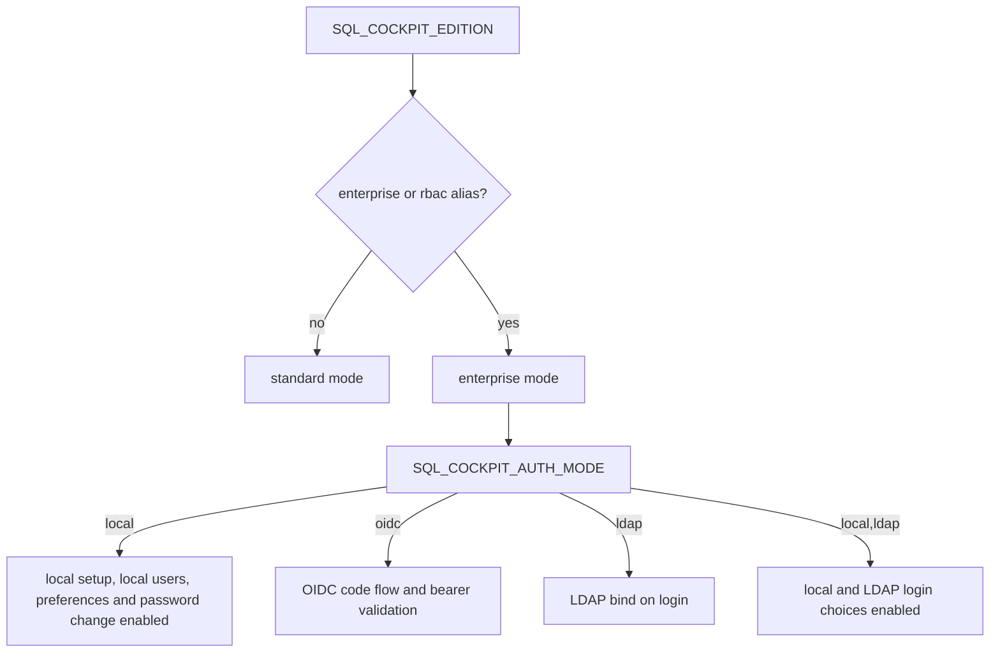

# Enterprise Mode Settings

This page documents how to run SQL Cockpit in enterprise mode and what each enterprise/auth/observability setting does.

## What enterprise mode changes

Enterprise mode is enabled when:

- `SQL_COCKPIT_EDITION=enterprise`
- `SQL_COCKPIT_EDITION=rbac` (legacy alias still normalized to `enterprise`)

When enterprise mode is active, the API enables enterprise auth/authorization and security telemetry paths in `sql-cockpit-api/lib/enterprise-mode.js`.

## Storage location and precedence

For all settings on this page:

- Primary storage location: process environment variables (`SQL_COCKPIT_*`).
- Typical files used to populate those variables:
  - repo `.env.local` for local runs
  - repo `.env.example` as baseline defaults/template
  - repo `.env.compose` for Docker Compose profile overrides
- Runtime override path: CLI args passed to `sql-cockpit-api/server.js` (for example `--edition`, `--authMode`, `--oidcIssuer`) override environment values.

Code path for precedence resolution:

- `sql-cockpit-api/server.js` builds `options.*` from `argv.*` first, then `process.env.*`, then hardcoded defaults.

## Quick start: enterprise + local auth

Use this when you want enterprise instrumentation/authorization behavior but keep local sign-in.

```dotenv
SQL_COCKPIT_EDITION=enterprise
SQL_COCKPIT_AUTH_MODE=local
SQL_COCKPIT_METRICS_ENABLED=true
SQL_COCKPIT_LOG_FORMAT=text
SQL_COCKPIT_AUDIT_LOG_SINK=stdout
```

Then restart the API process and validate:

1. `GET /api/auth/status` returns `"edition": "enterprise"` and `"authMode": "local"`.
2. `GET /metrics` returns Prometheus content (when metrics are enabled).
3. Audit events appear in logs when authentication actions occur.

## Quick start: local + LDAP auth

Use a comma-separated `SQL_COCKPIT_AUTH_MODE` value when more than one provider should be available from the login page.

```dotenv
SQL_COCKPIT_EDITION=enterprise
SQL_COCKPIT_AUTH_MODE=local,ldap
SQL_COCKPIT_LDAP_URL=ldaps://ad.example.com
SQL_COCKPIT_LDAP_USER_PRINCIPAL_SUFFIX=example.com
```

Then restart the API process and validate:

1. `GET /api/auth/status` returns `"authModes": ["local", "ldap"]`.
2. The login page shows both local and LDAP sign-in choices.
3. A known local admin and a known LDAP user can each sign in.

## Auth-mode flow



## Settings reference

| Setting | Storage location | Valid values | Default | Code paths affected | Operational risk | Safe change procedure | Confidence |
| --- | --- | --- | --- | --- | --- | --- | --- |
| `SQL_COCKPIT_EDITION` | `SQL_COCKPIT_EDITION` env var (`.env.local`, `.env.example`, optional CLI `--edition`) | `standard`, `enterprise`, `rbac` (legacy alias that normalizes to enterprise) | `standard` | `sql-cockpit-api/server.js` option mapping, `sql-cockpit-api/lib/enterprise-mode.js` edition normalization and authz enforcement | Unexpected auth behavior changes if flipped in-place (for example RBAC checks begin enforcing). | Change during a maintenance window, restart API, verify `/api/auth/status` and a basic sign-in path before opening to users. | Confirmed |
| `SQL_COCKPIT_AUTH_MODE` | `SQL_COCKPIT_AUTH_MODE` env var (optional CLI `--authMode`) | Comma-separated list containing `local`, `ldap`, and/or `oidc`; single values such as `local` still work; unknown/empty values fall back to `local` | `local` | `server.js` auth routes (`/api/auth/*`), setup/password/preferences gating, `enterprise-mode.js` auth mode normalization and request authentication, `rbac-auth-store.js` provider defaults | Lockout risk if external modes are enabled without completing required OIDC/LDAP settings; disabling `local` removes break-glass local login. | Stage in non-prod first, set required OIDC/LDAP variables, restart API, then validate `/api/auth/status` reports the expected `authModes` and test each enabled sign-in path. | Confirmed |
| `SQL_COCKPIT_OIDC_ISSUER` | `SQL_COCKPIT_OIDC_ISSUER` env var (optional CLI `--oidcIssuer`) | HTTPS issuer URL, no trailing slash required | empty | `enterprise-mode.js` OIDC discovery and token issuer validation | OIDC sign-in fails if missing/incorrect in `oidc` mode. | Set issuer, restart API, test `/.well-known/openid-configuration` reachability and full login callback flow. | Confirmed |
| `SQL_COCKPIT_OIDC_AUDIENCE` | `SQL_COCKPIT_OIDC_AUDIENCE` env var (optional CLI `--oidcAudience`) | Audience string expected in token `aud` claim | empty | `enterprise-mode.js` token audience verification (`expectedAudience = oidcAudience || oidcClientId`) | Incorrect value causes valid tokens to be rejected. | Set to IdP app audience, restart API, validate one successful and one intentionally invalid-token request. | Confirmed |
| `SQL_COCKPIT_OIDC_CLIENT_ID` | `SQL_COCKPIT_OIDC_CLIENT_ID` env var (optional CLI `--oidcClientId`) | OIDC client/app id | empty | `enterprise-mode.js` auth code flow (required for `/api/auth/oidc/start`) and audience fallback | OIDC browser login cannot start without it; audience checks may be weaker if both audience and client id are blank. | Set client id, restart API, verify `/api/auth/oidc/start` redirect and callback success. | Confirmed |
| `SQL_COCKPIT_LDAP_URL` | `SQL_COCKPIT_LDAP_URL` env var (optional CLI `--ldapUrl`) | `ldap://...` or `ldaps://...` URL | empty | `enterprise-mode.js` LDAP bind path in `authenticateLdapCredentials` | Login hard-fails in LDAP mode when missing/invalid. | Prefer `ldaps://`, test with one service account/user in staging, then roll to production. | Confirmed |
| `SQL_COCKPIT_LDAP_DOMAIN` | `SQL_COCKPIT_LDAP_DOMAIN` env var (optional CLI `--ldapDomain`) | Domain suffix used to build bind user when username lacks `@`/`\` | empty | `enterprise-mode.js` bind username construction | Wrong domain can cause false login failures. | Set only if usernames are entered short-form; verify generated bind UPN against directory conventions. | Confirmed |
| `SQL_COCKPIT_LDAP_USER_PRINCIPAL_SUFFIX` | `SQL_COCKPIT_LDAP_USER_PRINCIPAL_SUFFIX` env var (optional CLI `--ldapUserPrincipalSuffix`) | UPN suffix, for example `corp.example.com` | empty | `enterprise-mode.js` bind username construction (takes precedence over `LDAP_DOMAIN`) | Wrong suffix prevents successful binds. | Set explicitly for multi-domain estates; validate with two representative users. | Confirmed |
| `SQL_COCKPIT_LDAP_SKIP_CERT_VALIDATION` | `SQL_COCKPIT_LDAP_SKIP_CERT_VALIDATION` env var (optional CLI `--ldapSkipCertValidation`) | Boolean: `true` or `false` | `false` | `enterprise-mode.js` LDAP TLS certificate validation behavior | `true` allows MITM-style trust bypass and should be treated as emergency-only. | Keep `false`; if temporarily set to `true` for incident mitigation, document and schedule immediate revert after certificate fix. | Confirmed |
| `SQL_COCKPIT_RBAC_PERMISSIONS` | `SQL_COCKPIT_RBAC_PERMISSIONS` env var (optional CLI `--rbacPermissions`) | Comma-separated permissions, supports exact, wildcard (`*`), and prefix wildcard (`prefix.*`) checks | empty | `enterprise-mode.js` global permission set merged into session permissions; authorization checks via `isAllowedPermission` | Overly broad values can silently over-grant API capabilities. | Apply least privilege, start with read-only style scopes, and verify denied paths before enabling write/admin actions. | Confirmed |
| `SQL_COCKPIT_OTEL_ENABLED` | `SQL_COCKPIT_OTEL_ENABLED` env var (optional CLI `--otelEnabled`) | Boolean: `true` or `false` | `false` | `enterprise-mode.js` audit export condition (`auditSink === otlp` and enabled) | Misconfigured export may drop intended observability signals. | Enable only after OTLP endpoint health is confirmed; monitor fallback audit log entries. | Confirmed |
| `SQL_COCKPIT_OTEL_ENDPOINT` | `SQL_COCKPIT_OTEL_ENDPOINT` env var (optional CLI `--otelEndpoint`) | OTLP collector base URL (runtime posts to `<endpoint>/v1/logs`) | empty | `enterprise-mode.js` OTLP audit POST target | Wrong endpoint causes export failure and reliance on fallback logging. | Set endpoint, restart API, verify collector receives `v1/logs` payloads, and check for fallback log entries. | Confirmed |
| `SQL_COCKPIT_METRICS_ENABLED` | `SQL_COCKPIT_METRICS_ENABLED` env var (optional CLI `--metricsEnabled`) | Boolean: `true` or `false` | `false` from env template; runtime fallback defaults to `true` in enterprise edition and `false` otherwise when unset | `enterprise-mode.js` metric counters/histograms and rendering; `server.js` `/metrics` endpoint response | Exposing metrics on shared networks can leak operational detail. | Keep listener on trusted interfaces only, enable deliberately, and confirm `/metrics` output does not expose sensitive labels. | Confirmed |
| `SQL_COCKPIT_METRICS_BIND` | `SQL_COCKPIT_METRICS_BIND` env var (optional CLI `--metricsBind`) | String endpoint hint | empty | Parsed in `server.js`, surfaced in `enterprise-mode.js` settings object | Operators may assume it binds a dedicated metrics listener, but current implementation does not create a separate listener from this value. | Treat as informational until dedicated bind behavior is implemented; rely on main API listener/network controls for exposure management. | Confirmed (current code) |
| `SQL_COCKPIT_LOG_FORMAT` | `SQL_COCKPIT_LOG_FORMAT` env var (optional CLI `--logFormat`) | `text` or `json` (other values normalize to `text`) | `text` | `enterprise-mode.js` audit emission formatting to stdout | Parsing pipelines may break if format changes unexpectedly. | Announce format changes to log consumers, switch in staging first, and verify downstream parsing dashboards/alerts. | Confirmed |
| `SQL_COCKPIT_AUDIT_LOG_SINK` | `SQL_COCKPIT_AUDIT_LOG_SINK` env var (optional CLI `--auditLogSink`) | `stdout`, `otlp` (other values are accepted but have no dedicated sink logic) | `stdout` | `enterprise-mode.js` audit sink routing and OTLP export logic | Unsupported sink strings can create an observability blind spot. | Use `stdout` or `otlp`; if using `otlp`, also set `OTEL_ENABLED=true` and `OTEL_ENDPOINT`, then test with real login events. | Confirmed |

## Safe rollout checklist

1. Set `SQL_COCKPIT_EDITION=enterprise`.
2. Choose one or more auth modes with `SQL_COCKPIT_AUTH_MODE`; for example `local,ldap`.
3. Keep `SQL_COCKPIT_LDAP_SKIP_CERT_VALIDATION=false` unless in a documented temporary exception.
4. Set observability (`METRICS_ENABLED`, `AUDIT_LOG_SINK`, `OTEL_*`) before production cutover.
5. Restart API.
6. Validate:
   - `/api/auth/status`
   - sign-in and sign-out path for selected auth mode
   - `/metrics` behavior
   - expected audit output (`stdout` and/or OTLP collector)

## Troubleshooting quick notes

- `405` on `/api/auth/oidc/start` or `/api/auth/oidc/callback`:
  - `SQL_COCKPIT_AUTH_MODE` does not include `oidc`, or Azure AD is disabled in persisted provider settings.
- LDAP login returns bind failures:
  - invalid credentials show a friendly browser message asking the user to check username, password, and domain.
  - validate `SQL_COCKPIT_LDAP_URL` protocol/host/port and username suffix/domain mapping.
  - check trusted audit output for the underlying `authn-ldap-bind` provider error when support needs more detail.
- No OTLP audit data:
  - ensure all three are set correctly: `SQL_COCKPIT_AUDIT_LOG_SINK=otlp`, `SQL_COCKPIT_OTEL_ENABLED=true`, `SQL_COCKPIT_OTEL_ENDPOINT=<collector>`.
- `/metrics` returns `metrics disabled`:
  - set `SQL_COCKPIT_METRICS_ENABLED=true` and restart.

## Uncertain conclusions

- None for the settings listed above based on current repository code; behavior claims are grounded in `sql-cockpit-api/server.js` and `sql-cockpit-api/lib/enterprise-mode.js` as of this change.
