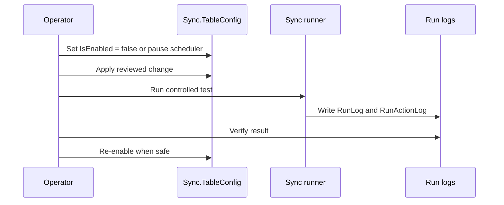

# Operational Safety

SQL Cockpit is intentionally lightweight, but it can still move, replace, or skip important data. The safest habit is to treat config changes like code changes.

## Before Changing Anything

1. Identify the target `SyncName` or `SyncId`.
2. Read the current row in `Sync.TableConfig`.
3. Check the current `Sync.TableState` checkpoint.
4. Check recent `Sync.RunLog` and `Sync.RunActionLog` entries.
5. Confirm whether a scheduler or SQL Agent job can start the row while you are editing it.
6. Decide how to disable or roll back the change.

## Safe Live-Change Pattern

## High-Risk Fields

| Field | Risk |
| --- | --- |
| `DestinationServer`, `DestinationDatabase`, `DestinationSchema`, `DestinationTable` | Can redirect writes to the wrong destination. |
| `SyncMode` | Can change from incremental to full-refresh behaviour. |
| `FullScanAllow` | Can allow expensive reads. |
| `SourceWhereClause` | Can silently exclude or include unexpected rows. |
| `KeyColumnsCsv` | Can corrupt upsert matching if keys are wrong. |
| `WatermarkColumn`, `WatermarkType` | Can skip or repeat batches if checkpoint logic no longer matches source data. |
| `BatchSize`, `MaxBatchesPerRun` | Can affect lock duration, log pressure, and recovery time. |
| `PreSyncSql`, `PostSyncSql` | Can run arbitrary SQL around the sync. |
| SQL-auth password fields | Can expose credentials and break runs after rotation. |

## When A Run Fails

1. Do not immediately rerun a full refresh until the destination state is understood.
2. Read the newest run log and action log entries.
3. Check local launcher or child-process logs under `.\Logs`.
4. Use [Analyze Run Logs](../operations/analyze-run-logs.md) for text log summaries.
5. If the failure came through the dashboard, check web-app error logs under `.\Logs\WebApp`.
6. Disable the row if repeated retries could cause load or data risk.

## Sharing Evidence

Before sharing logs or screenshots outside the trusted operator group, redact:

- SQL-auth usernames and passwords
- connection strings
- customer or business-sensitive table names
- server names where policy requires it
- stack traces that include local paths or payload bodies

