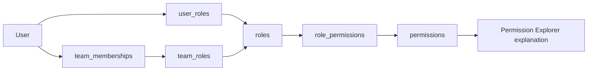

# Permission Explorer

`/admin/rbac/explorer` is a read-only RBAC diagnostic page for administrators and auditors. It explains why a user can or cannot perform a protected action, lists effective permissions by source, shows declared route permission mappings, and reports broad or stale grants.



## Access

| Surface | Authentication and RBAC |
| --- | --- |
| `/admin/rbac/explorer` | Authenticated dashboard user with `permissions.explain`; local administrators also pass the dashboard permission check. |
| `GET /api/admin/permission-explorer/users` | Same-origin authenticated session with `permissions.explain` or local administrator access. |
| `GET /api/admin/permission-explorer/users/{userId}/effective` | Same-origin authenticated session with `permissions.explain` or local administrator access. |
| `POST /api/admin/permission-explorer/explain` | Same-origin authenticated session with `permissions.explain` or local administrator access. |
| `GET /api/admin/permission-explorer/routes` | Same-origin authenticated session with `permissions.explain` or local administrator access. |
| `GET /api/admin/permission-explorer/findings` | Same-origin authenticated session with `permissions.explain` or local administrator access. |

## Storage and Defaults

| Item | Storage location | Valid values/defaults | Code paths affected | Operational risk | Safe change procedure |
| --- | --- | --- | --- | --- | --- |
| `permissions.explain` | Local SQLite `permissions` table, seeded by `sql-cockpit-api/lib/rbac-auth-store.js` | Permission key string. Seeded automatically. | Permission Explorer page and `/api/admin/permission-explorer/*` routes. | Medium: grants visibility into users, effective RBAC, route permissions, and overbroad access findings. | Grant first to a test auditor role, sign in as that user, confirm explorer access, then grant to production auditor/admin roles. |
| Permission source trace | Local SQLite `users`, `roles`, `permissions`, `role_permissions`, `user_roles`, `teams`, `team_memberships`, `team_roles` | Active users, active roles, active teams, and active memberships only. | `getPermissionExplorerUserEffective`, `explainPermissionForUser`. | Medium: reveals why a user can perform protected actions. | Review output in non-production; do not expose explorer to general operators. |
| Route inventory | `sql-cockpit-api/lib/permission-explorer-routes.js` | Declared route rows with method, path, permission, risk, certainty, and description. | `/api/admin/permission-explorer/routes`, route explanations, OpenAPI/docs alignment. | Low to medium: incomplete inventory can understate unmapped protected routes. | Add/update route rows in the same change as protected endpoint changes. Mark uncertain entries explicitly. |

## API Shapes

`GET /api/admin/permission-explorer/users`

- Optional query: `search`.
- Response: `{ "users": [...] }`.
- Rows include public user fields and `effectiveRoles`.

`GET /api/admin/permission-explorer/users/{userId}/effective`

- Response includes `user`, `roles`, `permissions`, and `summary`.
- Permission rows contain `key` and `sources`.
- Source rows identify `user-role`, `team-role`, or local admin override where applicable.

`POST /api/admin/permission-explorer/explain`

Request one permission:

```json
{ "userId": "user-id", "permission": "tasks.view" }
```

Request one declared route:

```json
{ "userId": "user-id", "method": "POST", "path": "/api/admin/users/{userId}/roles" }
```

Response includes:

- `allowed`
- `permission`
- optional `route`
- `matchType`: `exact`, `wildcard`, `prefix-wildcard`, `local-admin`, `inactive-user`, or `none`
- `matchedPermission`
- `explanation`
- `sources`

`GET /api/admin/permission-explorer/routes`

- Response: `{ "routes": [{ "method": "...", "path": "...", "permission": "...", "risk": "...", "certainty": "...", "description": "..." }] }`.
- Current certainty values are `declared`. Add `inferred` or `unmapped` only when a route has not been fully migrated into declared metadata.

`GET /api/admin/permission-explorer/findings`

- Response: `{ "findings": [{ "severity": "...", "type": "...", "subject": "...", "detail": "...", "remediation": "..." }] }`.
- Findings are read-only and do not mutate RBAC data.

## Operational Risk

Risk is medium. The feature does not grant, revoke, or mutate access, but it exposes security posture: local admin users, wildcard grants, inactive users with retained roles, and route permission mappings. Treat access as auditor/admin-grade.

## Safe Test Procedure

1. Sign in as a local administrator.
2. Open `/admin/rbac/explorer`.
3. Select a known non-admin user.
4. Explain `users.view` and confirm the result matches that user's roles.
5. Explain a permission the user should not have and confirm the denial path says no active role, team role, wildcard, or local-admin override grants it.
6. Select a route from the route selector and confirm the route permission is shown.
7. Open `/api-docs` and confirm the five `/api/admin/permission-explorer/*` routes are listed.
8. Review findings and confirm no RBAC data was changed.

