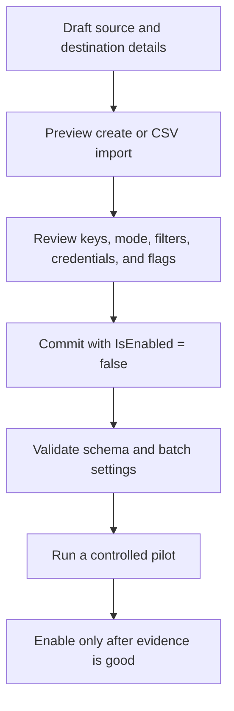
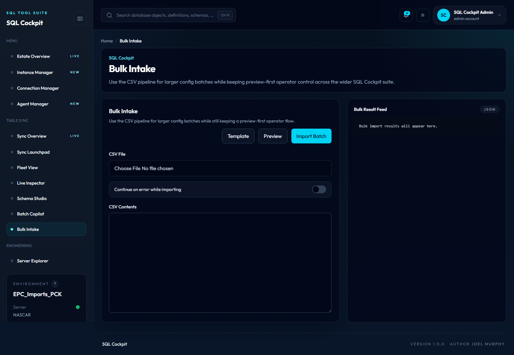

# Sync Configuration Workflow

Sync jobs are controlled by rows in `Sync.TableConfig`. Each row describes one source table, one destination table, runtime mode, keys, filters, credentials, and safety flags.

Because config rows can change live runtime behaviour, treat every edit as an operational change.

## Recommended Workflow



## Create One Row

Use the dashboard create workflow or call `POST /api/configs` with `previewOnly = true` first.

Keep new rows disabled:

```text
IsEnabled = false
```

Review at least:

- `SyncName`
- `SyncMode`
- source and destination server/database/schema/table
- authentication fields
- `KeyColumnsCsv`
- `WatermarkColumn` and `WatermarkType`
- `SourceWhereClause`
- `BatchSize`
- `MaxBatchesPerRun`
- `FullScanAllow`
- `InsertOnly`
- `AutoCreateDestinationTable`
- `ValidateDestinationSchema`
- `PreSyncSql` and `PostSyncSql`

## Import Many Rows

Use Bulk Intake or `POST /api/configs/import-csv`.

Recommended settings:

- preview before commit
- `continueOnError = false` unless partial success is explicitly acceptable
- import with `IsEnabled = false`
- review inserted rows before a scheduled runner can see them

## Full Refresh Rows

Full refresh work can replace destination data. Before enabling:

1. Confirm the destination table is correct.
2. Confirm the refresh window and rollback plan.
3. Confirm whether destination auto-create or schema validation is expected.
4. Run in a non-production or low-risk context first.
5. Check logs after the first run.

## Incremental Rows

Incremental rows depend on key and watermark semantics.

Before enabling:

1. Confirm `KeyColumnsCsv` uniquely identifies destination rows.
2. Confirm the watermark column moves in the expected direction.
3. Confirm `SourceWhereClause` does not hide rows that should be copied.
4. Confirm `BatchSize` is conservative enough for the first run.
5. Confirm the current `Sync.TableState` checkpoint is expected.

## Run One Row From SQL Cockpit

Fleet View and Live Inspector can start an individual sync row with the same
legacy entrypoint used by the Aptos spawn scripts: `Sync-ConfiguredSqlTable.ps1`
with a single `SyncId`. SQL Cockpit queues the run in Task Manager first and
then executes the script from that task run.

Before selecting **Run Sync Now**:

1. Confirm the row is enabled and points at the intended source and destination.
2. Confirm `Sync.TableState.LastStatus` is not `Running`.
3. Review `PreSyncSql`, `PostSyncSql`, `SyncMode`, `SourceWhereClause`, and
   batch limits.
4. Use a low-risk row first; the API returns `TaskId` and `TaskRunId`.
5. Inspect the Task Manager run logs for script output, then refresh the row
   after completion and inspect `Sync.RunLog` and
   `Sync.RunActionLog`.

Operational risk: high. A manual run can write destination data and advance
incremental checkpoints. Disabled rows are rejected by default.

## Where To Look Up Fields

Use:

- [Configuration Overview](../configuration/overview.md)
- [Configuration Reference](../configuration/reference.md)
- [Flag Pages](../configuration/flags/index.md)
- [Config Tables](../database/config-tables.md)

## Evidence To Keep

For any config change, keep:

- who requested it
- old and new values
- preview output
- approval or ticket reference where applicable
- first run ID and result
- rollback or disable procedure

## Bulk Intake Screenshot

<!-- AUTO_SCREENSHOT:bulk-intake:START -->


*Bulk Intake previews CSV imports before writing rows into Sync.TableConfig.*
<!-- AUTO_SCREENSHOT:bulk-intake:END -->
